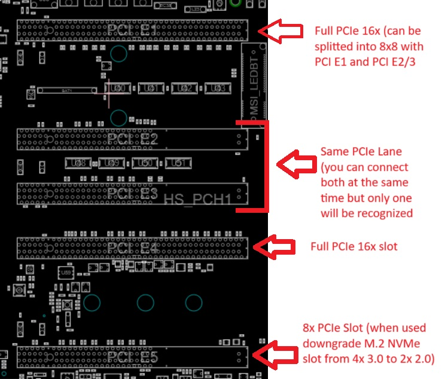

# MSI MS-7883 (X99A GODLIKE 2011-3) BIOS Mod

## Introduction

This repository contains BIOS modifications for the MSI MS-7883 (X99A GODLIKE 2011-3) motherboard.

The MSI MS-7883 (X99A GODLIKE 2011-3) BIOS Mod project aims to improve the functionality and performance of the motherboard through various BIOS modifications. The project is based on the original BIOS version 7883v1A1.zip and utilizes AMIBCP version 5.02.0031, UEFITool 28 & NE and HxD Hex Editor.

WinRaid Level1Techs Original Post: https://winraid.level1techs.com/t/offer-msi-x99a-godlike-gaming-rev-1-0-1-1-bios-mod-pcie-biffurcation/101333

## Screenshots

# DISCLAIMER BEFORE / AFTER FLASHING:

Please note that the M-Flash feature may not work as expected with Xeon processors on the MSI MS-7883 (X99A GODLIKE 2011-3) motherboard. It is recommended to use an i5 or i7 processor to utilize M-Flash properly.
Also, you might encounter issues with M-Flash while using a Xeon processor and/or experience difficulties saving changes and rebooting the BIOS. In such cases, you may need to save changes and reboot by using the "Save" function and pressing CTRL+ALT+DEL.
IMPORTANT: it's essential to remove the Intel Xeon processor when using M-Flash, as it may not function correctly otherwise. Please be aware that this issue is a known bug with MSI and is not related to the modifications made by this BIOS mod (source: https://forum-en.msi.com/index.php?threads/cannot-enter-m-flash-on-x99a-gaming-7-with-bios-7885vhg-or-7885vhh2-with-cpu-xeon-1620v3.343307/)

# **READ BEFORE FLASHING: BIOS Recovery and Reverting:**

In the event that the BIOS update fails for any reason and the PC fails to boot, or if users wish to revert to the original BIOS, there are several methods available:

- **Using M-Flash:** If the system still boots, users can utilize M-Flash to flash the original BIOS. Ensure to have a USB drive with the original BIOS file ready for this purpose.

- **Using BIOS Switch:** If the system fails to boot entirely, users can use the BIOS switch located on the motherboard to switch to the second BIOS. Once switched, they can flash the primary BIOS using the secondary BIOS. After successful flashing, they can switch back to the primary BIOS.

It's important to note that before applying this mod, it's recommended to flash both BIOS chips with the latest official BIOS version provided by MSI. This ensures compatibility and stability before applying any modifications.

# **(weird) PCIe Hardware Limitations**

- The MSI MS-7883 (X99A GODLIKE 2011-3) motherboard features 5 PCIe slots. However, only slots number 1 and 4 operate at full x16 speed, while the last slot (slot 5) operates at x8 speed.

- It's important to note that if the last 8x PCIe slot (slot 5) is utilized, the M.2 NVMe port will downgrade from x4 3.0 to x2 2.0.

- Additionally, slots number 2 and 3 are shared with slot number 1 to create a dual PCIe 8x configuration (2x 8x). These slots are electrically connected the same way, which means they cannot be used simultaneously.

- With the mod, users can manually configure the PCIe lanes to split into 2x 8x by utilizing slots 1 and 2/3.

# Original BIOS
- **Version**: 7883v1A1.zip
- **Download Link**: [7883v1A1.zip](https://download.msi.com/bos_exe/mb/7883v1A1.zip)
- **AMIBCP Version**: 5.02.0031
- **ReSizeBar Source (PLEASE READ THE REBAR DOCUMENTATION IF YOU PLANNED TO USE IT)**: [ReBarUEFI](https://github.com/xCuri0/ReBarUEFI)

# Updated Firmwares:

CPU:

| # | Type      | CPUID | Platforms          | Revision | Date       | State | Size  | Offset  | Last |
|---|-----------|-------|--------------------|----------|------------|-------|-------|---------|------|
| 1 | Microcode | 406F1 | EF (0,1,2,3,5,6,7) | B000040  | 2021-05-19 | PRD   | 0x8C00| 0x18    | Yes  |
| 2 | Microcode | 406F0 | EF (0,1,2,3,5,6,7) | 14       | 2015-07-02 | PRD   | 0x7C00| 0x8C18  | Yes  |
| 3 | Microcode | 306F2 | 6F (0,1,2,3,5,6)   | 49       | 2021-08-11 | PRD   | 0x9800| 0x10818 | Yes  |
| 4 | Microcode | 306F1 | EF (0,1,2,3,5,6,7) | 14       | 2014-01-10 | PRD   | 0x8800| 0x1A018 | Yes  |

Other:

| EFI Lx Killer Undi | OROM Lx Killer E2xxx |
|---------------------|----------------------|
| 1.1.0.13            | 2.1.1.5              |
|                     | 2.1.1.5              |

| EFI Intel RST VMD Driver | OROM Intel RST for SATA |
|---------------------------|-------------------------|
| 14.8.2.2397               | 14.8.2.2397             |

## Changelog

### Version 0.1

- Initial Release

#### Added
- M.2 Mode 0471
- CPU PCI-E Lanes Control 0BDD
- USB Speed Optimization
- DokT Branded Bios

### Version 0.2

- Updated Microcodes & Firmwares

### Version 0.3

#### Goals
- UEFI Custom Logo (1080p)
- ResizeBar Support (0.3.3)
- Hidden Menu into Overclocking Profiles (Pressing escape in the menu) (0.3.4)
- Custom UEFI setup logo (0.3.1)
- Custom Background in F11 Boot Menu (0.3.2)

#### Changes
- [Bug] UEFI setup logo
- [Bug] Custom Background in F11 Boot Menu not showing

### Version 0.3.1

- [PATCH] UEFI setup logo
- [BUG] Custom Background in F11 Boot Menu not showing
- [NEW] M-FLASH Disclaimer

### Version 0.3.2

- [PATCHED] F11 boot menu patched (doesn't support FHD resolution)
- Updated MOD version string
- UEFI + Secure Boot enabled by default
- Above 4G Decoding enabled by default (For ResizeBar full support coming next release)
- ~~Enabled AMT (for server usages)~~ (Found out it was not working even if i enable it. Maybe a patched/newer version of ME would make this work?)
- Auto Power On when A/C is loss (Server usage)
- [NEW] Added SLIC Table Controller
- Fast Boot enabled by Default

### Version 0.3.3

- [NEW] Added ResizeBar 0.3 Support

### Version 0.3.4

- [NEW] PCIe Bifurcation for IOU0 / IOU1 (4x4x4x4)

### Version 0.3.5

- [Fix] MOD revision patched
- [WIP] Hidden menu

## How to Install

Follow the steps below to install the modified BIOS:

1. Download the modded BIOS from the Releases link (https://github.com/Dok-T/MS-7883/releases).
2. Format a USB drive (32gb MAX) in FAT32 and copy the file in the root of the USB drive
3. Flash the modified BIOS to your MSI MS-7883 motherboard using M-FLASH.

## Disclaimer

**Warning:** Flashing a modified BIOS carries risks. Ensure you understand the process and its implications before proceeding. Incorrect flashing can brick your motherboard.

## License

This project is licensed under the [MIT License](LICENSE).

## Contributors / Specials Thanks

- DokT
- xCuri0 (ResizeBar - https://github.com/xCuri0/ReBarUEFI)
- WInRaid Level1Tech Forum (https://winraid.level1techs.com/)
- Eugene
- Sweet_Kitten

